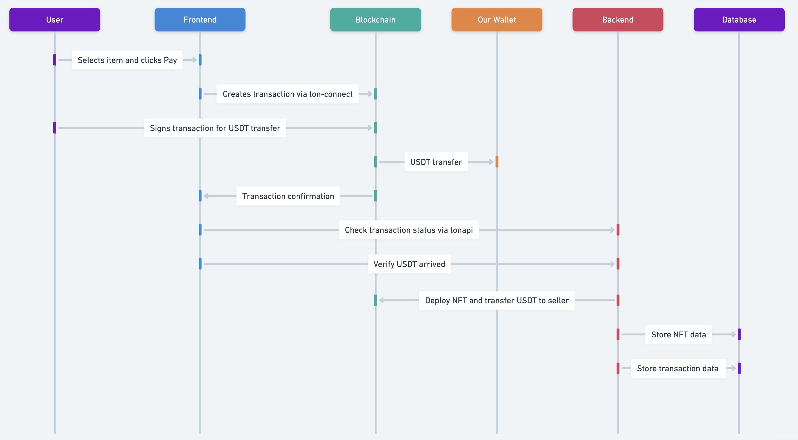

Поскольку времени в обрез, я решил всё упростить и убрать контракт брокера. Пользователь будет отправлять деньги напрямую на наш кошелёк; затем мы проверим, что он прислал, и сразу же выполним необходимые действия:

### Примерная архитектура взаимодействия фронтенда и бэкенда с блокчейном

#### Этап 1: Оплата

Пользователь выбирает товар и переходит в корзину, где у него подключён кошелёк. После нажатия кнопки "Оплатить" на фронтенде формируется транзакция с помощью библиотеки [ton-connect/ui](https://www.npmjs.com/package/@tonconnect/ui). Пользователь подпишет транзакцию для перевода USDT (или другого jetton) напрямую на наш кошелёк.

##### Детализация транзакции:

Для перевода jetton (USDT) на наш кошелёк используется функция [jettonTransaction](https://github.com/vityooook/Futurum/blob/main/api/BrokerContract.ts). Необходимые параметры:

- `amount` — количество jetton, которое переводится;
- `destinationAddress` — адрес нашего кошелька;
- `responsAddress` — адрес покупателя, на который вернётся остаток после комиссий;
- `forwardFee` — комиссия, которая будет отправлена нашему кошельку.

##### Пример оформления транзакции:

```javascript
// Получаем адрес jetton-кошелька покупателя:
const response = await args.client.runMethod(JettonMasterAddress, "get_wallet_address", [{
  type: 'slice',
  cell: beginCell().storeAddress(BuyerWalletAddress).endCell()
}]);

const JettonWalletBuyer = response.stack.readAddress();

// Создаём payload для транзакции jetton:
const payload = jettonTransaction({
  amount: ..., // сколько пользователь должен отправить USDT
  destinationAddress: OurWalletAddress,
  responsAddress: BuyerWalletAddress,
  forwardFee: toNano("0.2")
});

// Формируем транзакцию:
const transaction = {
  validUntil: Math.floor(Date.now() / 1000) + 60, // Время валидности 60 сек
  messages: [
    { // Перевод USDT на наш кошелёк
      address: JettonWalletBuyer,
      amount: "250000000", // Сумма перевода TON для оплаты комиссии 
      payload: payload
    }
  ]
};
```

#### Этап 2: Проверка транзакции

После подтверждения транзакции пользователем ton-connect нам возращает потверждеие. затем мы на фронте делаем провеку, что деньги дошли до кошелька с помощью следующего метада https://tonapi.io//api-v2 (/v2/accounts/{account_id}/events)

#### Этап 3: Финальные действия и деплой NFT

Убедившись, что USDT поступили на наш кошелёк, через 2–3 минуты нужно выполнить следующие действия:

1. Деплой NFT.
2. Перевод USDT продавцу.
3. Перевод реферальной комиссии (если есть).

##### Хранение данных о NFT:

Для деплоя NFT необходимо сохранить в базе данных следующую информацию:

- `nft_index` — уникальный индекс NFT;
- `nft_address` — адрес NFT;
- `seller` — продавец товара;
- `item_metadata` — метаданные товара. Пример формата метаданных можно увидеть здесь:  
  [Пример метаданных](https://s.getgems.io/nft/c/65f1941c8d4e725b494dd4b2/2000003/meta.json).

Чтобы обсудить все детали, необходимо созвониться и уточнить моменты, касающиеся структуры базы данных и работы с коллекциями.